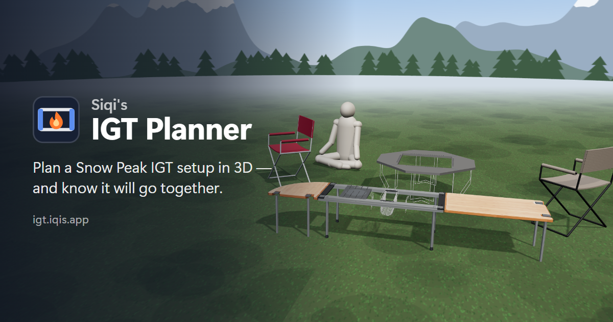

# Siqi's IGT Planner



**[igt.iqis.app](https://igt.iqis.app)** — plan a Snow Peak **Iron Grill Table** (IGT) setup
in 3D, to the millimetre, and know it will actually go together.

Frames, hook-on boards, corners, slide-in extensions, burners, trays, the Jikaro fire ring,
chairs, tarps: drop them in and the planner works out where each one *really* ends up —
from the measured hooks and brackets, not from bounding boxes — and tells you what doesn't
fit, what the manuals forbid, and what the whole kit weighs. Nothing to install, no account;
designs live in your browser and travel as links.

**[✦ Use it with your own AI](docs/AI.md)** — the rules engine (`web/core.js`) has no DOM
and no three.js, so Claude, ChatGPT or any agent can design a layout and have the planner's
own rules check it: from a chat window (it writes a link), from a terminal
(`node scripts/igt.mjs evaluate`), or from code. The same guide is served to agents at
[igt.iqis.app/llms.txt](https://igt.iqis.app/llms.txt).

```sh
git clone https://github.com/iqis/igt-planner && cd igt-planner
py serve.py --port 8795            # -> http://localhost:8795/web/  (any static server works)
node scripts/igt.mjs example       # the rules from a terminal, no browser
```

Vanilla JavaScript and vendored three.js: no build step, no runtime dependencies.
MIT licensed. An independent project, **not affiliated with Snow Peak**; product names are
used only to say what each part is.

What follows is how it was built — where the numbers come from, and why they can be trusted.

## Why this is tractable

IGT looks like a 3D packing problem and isn't. A frame is a **linear run of unit slots**,
and every module claims a whole number of half-slots. Slot assignment is 1D interval
packing; everything else is a layer stacked on top (legs, rail clamps, hangers).

The unit pitch is never published. `derive_grid.py` recovers it by differencing frames of
known unit count, and **refuses to emit a constant the frame family does not corroborate**:

```
[collapsible]  W(n) = 250.0n + 96.0     zero residual, 3 frames
[standard]     W(n) = 250.0n + 96.0     zero residual, 2 frames
```

**unit = 250mm, half-unit = 125mm.** See [SCHEMA.md](SCHEMA.md) for the model — including
why span comes from the unit label and *never* from millimetres.

## Where the data comes from

No storefront has everything, so the catalog is a join on SKU (`CK-149`), which every
region carries. What each one is actually good for, measured rather than assumed:

| region | good for | not good for |
|---|---|---|
| **US** `snowpeak.com` | SKU, JAN, USD price, stock, images, collections, and descriptions (which state unit counts the product names omit, and link set components) | weight is *shipping* weight — 74–1200g heavier than the part |
| **JP** `ec.snowpeak.co.jp` | **the only source of geometry**: mm dimensions, 収納サイズ (packed size), true weight, material, set contents, and the manual PDF | — |
| **UK** `snowpeak.co.uk` | GBP price (Shopify, so the SKU join is clean) | **publishes no dimensions at all**, and its variant weights are duplicated: CK-149 and CK-150 are both listed at 4900g, though the 4-unit frame is 700g heavier |
| TW / KR | — | SPA storefronts whose scraped rows carry no SKU; nothing to join on, so they are left out rather than guessed at |

**Neither the US nor the JP catalog is a superset.** The US has 83 IGT products (the
Renewed/TR lines, US-only sets); the JP category has 70, of which 20 exist nowhere in the
US. The universe is the union.

And neither storefront's taxonomy is clean, in *both* directions: the US files Takibi grill
plates under `cookers` and 24 buckets and coolers under `storage`; the JP files the TUGUCA
wooden shelving line under IGT&キッチン. None of them can enter a unit slot, so membership
is gated on rules rather than on either vendor's own tree.

Two facts make the rest work:

- The JP spec table publishes **収納サイズ** (packed size), so "will this build fit in the
  carrying case / the car" is a data question, not a guess.
- The JP **セット内容** field lists a bundle's components *by SKU*, so official sets
  decompose into parts — the planner can tell you whether a set beats buying the pieces.

## Build the catalog

```sh
py scripts/fetch_us.py          # the 6 IGT collections       -> data/us_products_latest.json
py scripts/sync_jp_specs.py     # JP specs, from the snapshot -> data/jp_specs_latest.json
py scripts/fetch_regions.py     # JP + UK prices, from snaps  -> data/regions_latest.json
py scripts/derive_grid.py       # recover the unit pitch      -> catalog/grid.json
py scripts/build_catalog.py     # join + classify             -> catalog/igt-catalog.json
```

### It does not crawl what is already being crawled

A separate price tracker (`snowpeak-sale-watch`, not part of this repo) already fetches all ~2,100 JP product
pages, plus the US and UK catalogs, **every day** — and was throwing the JP spec table
away. It now keeps it, so this project *parses* the dimensional data instead of re-crawling
for it:

- **JP specs** — read from the daily snapshot. No network, and they refresh for free.
- **JP / UK prices** — read from the same snapshots.
- **US** — the only live fetch, and only the 6 IGT collection handles, because
  `/products.json` does not carry collection membership and the whole role taxonomy hangs
  off it. Six requests.

`fetch_jp_specs.py` remains as the bootstrap crawler. Its `--reparse` re-derives dimensions
from the stored `size_raw` offline, so a parser bug costs a second rather than another pass
over 2,100 pages — which is how four of them were found and fixed.

## The planner

Vanilla three.js, vendored — no build step, no CDN, works offline. It reads
`catalog/igt-catalog.json` directly, so a scraper fix shows up on reload.

- **Frame** and **legs** are chips; **tabletops** and **modules** click to drop into the
  first free run of half-slots. Drag a placed module along the rail — it snaps to the
  125mm grid and refuses to overlap.
- The occupancy bar under the table is the grid itself: one cell per half-slot.
- The bill lists what you carry, including the parts the layout implies but nobody places by
  hand (leg sets, rail joints, connection hooks, height adjusters), with the total weight.

Modules are drawn at their **own width, centred in the slots they claim**, never stretched
to fill them. That is the whole point of carrying real millimetres: a tray built 5mm
narrower than its unit shows a genuine gap, and the Flat Burner's 20mm-wider rim really
does sit on the rails. Stretching parts to their allocation would hide the one thing worth
seeing.

## Layout

```
scripts/     the five build steps above, plus smoke.mjs (below)
catalog/     committed output: grid.json, igt-catalog.json, overrides.json
web/         the planner: core.js (the rules, no DOM) + app.js (the 3D app, vendored three.js)
docs/AI.md   how to drive it from your own agent (also served as /llms.txt)
data/        raw fetches and timestamped archives (gitignored)
```

## Smoke test

```sh
npm install     # once -- puppeteer-core only, drives the Chrome already installed
npm run smoke   # ~15s: boot, place, hook, undo, share round-trip, bench dispatch,
                # zero console errors, and the on-demand renderer actually idling
```

The app itself still has no build step and no runtime dependencies; `package.json` exists
solely for this. A `pre-push` hook runs it and blocks a red push — on a fresh clone,
`cp scripts/hooks/pre-push .git/hooks/` — and it skips politely when `node_modules` is
absent.
